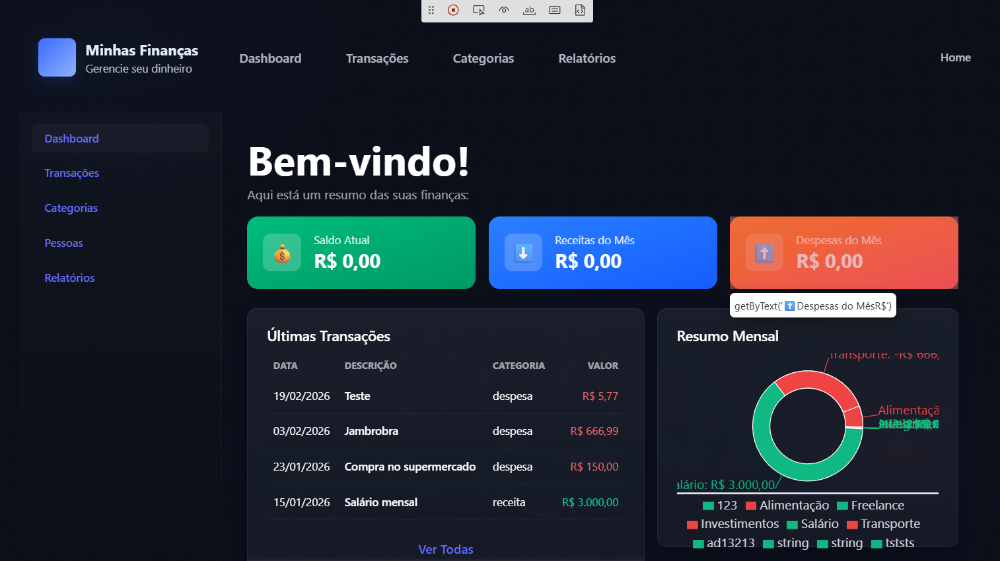

### Bug 004 - Falha na persistência de transação via Modal de Cadastro (Status Code Error)

### Resumo

Instabilidade no endpoint de criação de transações impede a persistência de novos registros, retornando erro genérico de interface mesmo com campos obrigatórios preenchidos.

### Severidade

Crítica

### Prioridade

Alta

### Ambiente

Frontend/API MinhasFinancas (Docker Localhost:5173)

### Status

Aberto

### Pré-condição

Estar autenticado e navegar até a aba de Transações.

### Passos para reproduzir

1. Acessar a tela de Transações.

2. Clicar no botão Adicionar Transação.

3. Preencher todos os campos: Descrição, Valor, Data, Pessoa e Categoria.

4. Clicar no botão Salvar.

### Resultado Atual

O sistema exibe o Toast notification: "Erro ao salvar transação. Tente novamente." e mantém o modal aberto, não refletindo o novo registro na tabela principal.

### Resultado Esperado

O modal deve ser fechado após o clique em Salvar e a nova transação deve aparecer imediatamente na listagem (Tabela).

### Regra de Negócio Violada

Persistência e integridade dos lançamentos financeiros.

### Evidência

