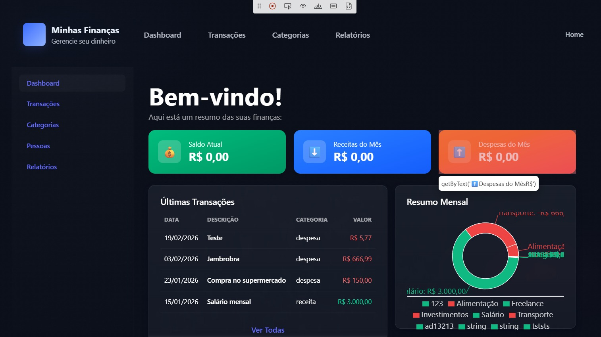

### Bug 005 - Falha de responsividade e overflow no gráfico de Resumo Mensal

### Resumo

O componente de gráfico (Donut Chart) na Dashboard não redimensiona corretamente, causando transbordo (overflow) e sobreposição de elementos independentemente da resolução da tela.

### Severidade

Média

### Prioridade

Média

### Ambiente

Frontend - Dashboard (Localhost:5173)

### Status

Aberto

### Pré-condição

Estar na tela de Dashboard com dados carregados para exibição do gráfico.

### Passos para reproduzir

1. Acessar a página inicial (Dashboard).

2. Observar o widget de Resumo Mensal.

3. Alterar o tamanho da janela do navegador ou alternar entre resoluções (Mobile/Desktop).

### Resultado Atual

O gráfico mantém dimensões fixas ou incorretas, sobrepondo as legendas à direita e ultrapassando os limites do card, tornando a leitura de dados ilegível.

### Resultado Esperado

O gráfico deve ser responsivo e ajustar seu diâmetro proporcionalmente ao container, mantendo uma margem segura em relação às legendas e bordas do card.

### Regra de Negócio Violada

Acessibilidade, responsividade e integridade visual da interface de usuário (UI).

### Evidência

